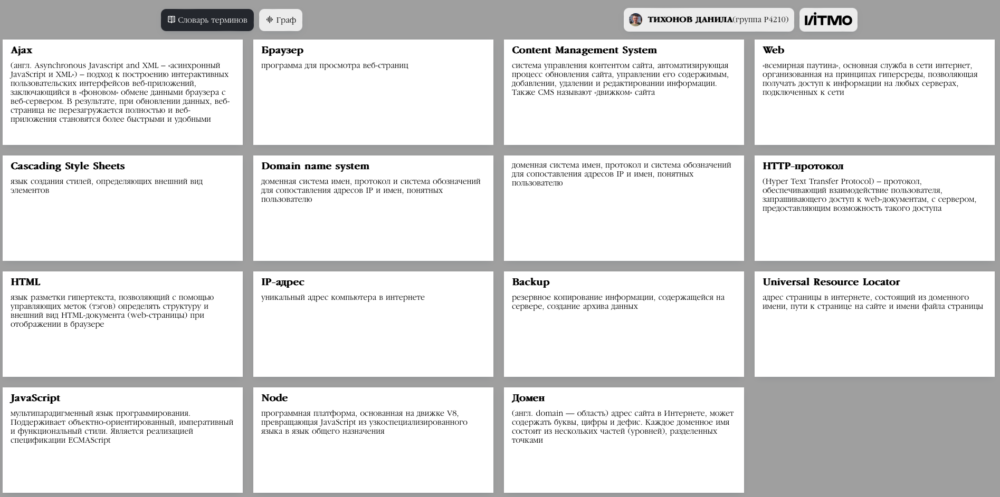
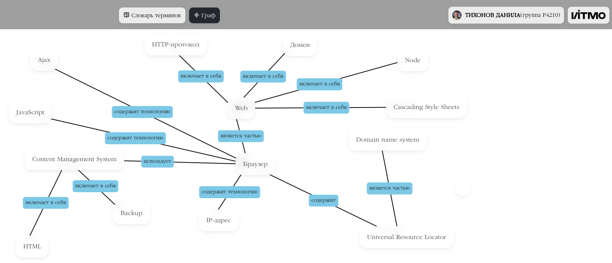

# Глоссарий веб-терминов + граф

## Сделано на React

### [Ссылка на github pages](https://TikhonovDanila.github.io/itmo_laboratory_work/2023_dec/)

Изображение словаря веб-терминов:

Изображение графа веб-терминов:

